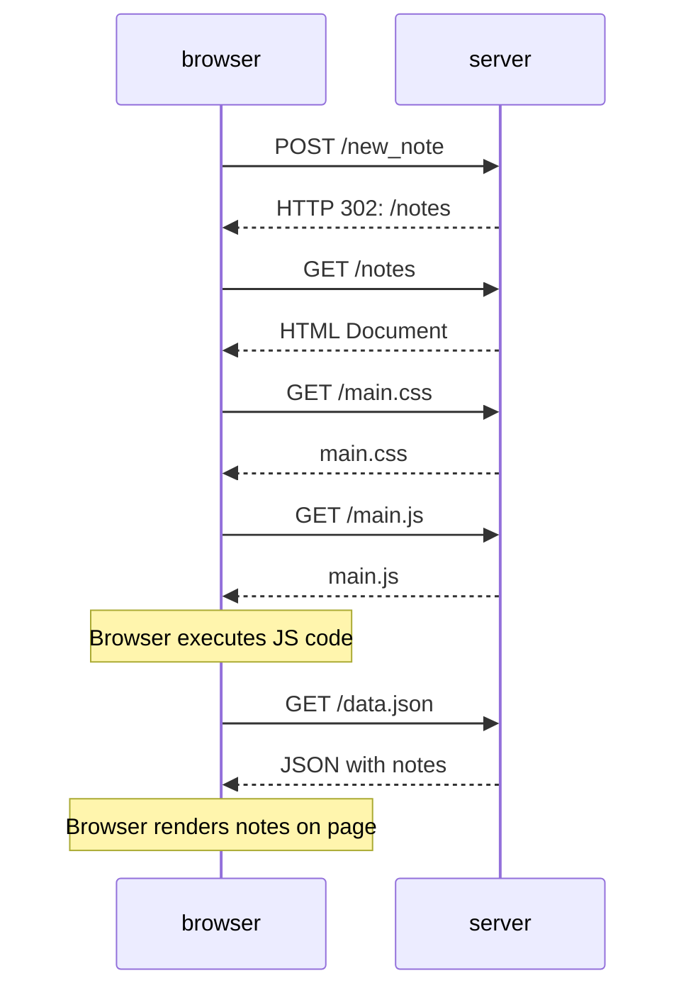

```mermaid
sequenceDiagram
    participant browser
    participant server

    browser->>server: POST /new_note
    server-->>browser: HTTP 302: /notes
    browser->>server: GET /notes
    server-->>browser: HTML Document
    browser->>server: GET /main.css
    server-->>browser: main.css
    browser->>server: GET /main.js
    server-->>browser: main.js

    Note over browser: Browser executes JS code
    browser->>server: GET /data.json
    server-->>browser: JSON with notes
    Note over browser: Browser renders notes on page
```
