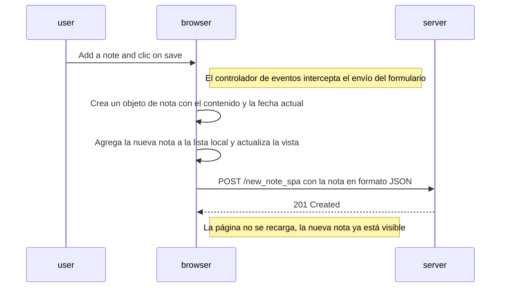

```mermaid
sequenceDiagram
    participant user
    participant browser
    participant server

    user->>browser: Add a note and clic on save
    Note right of browser: El controlador de eventos intercepta el envío del formulario
    browser->>browser: Crea un objeto de nota con el contenido y la fecha actual
    browser->>browser: Agrega la nueva nota a la lista local y actualiza la vista
    browser->>server: POST /new_note_spa con la nota en formato JSON
    server-->>browser: 201 Created
    Note right of browser: La página no se recarga, la nueva nota ya está visible
```
